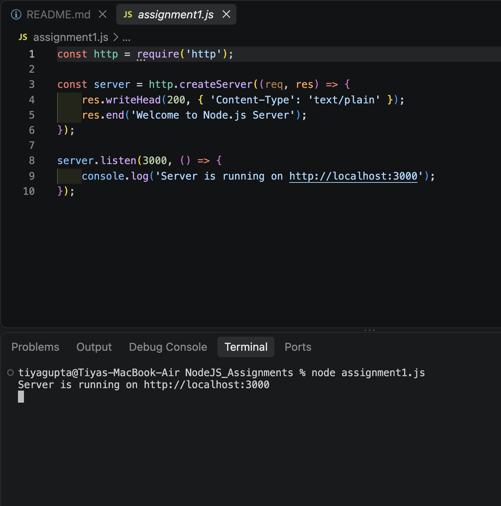
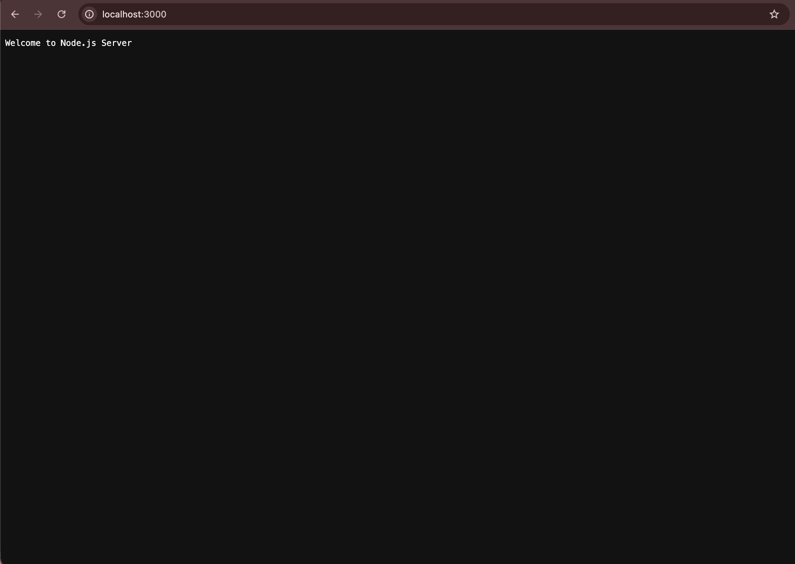
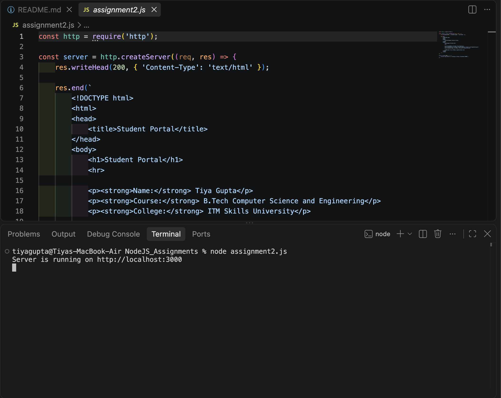
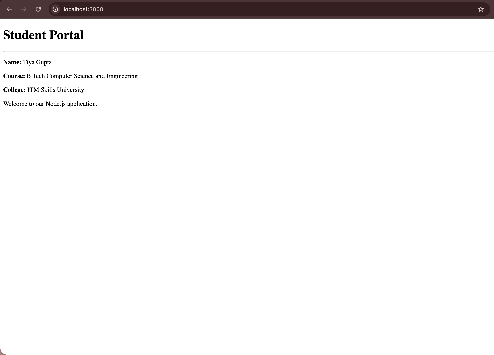

# Node.js HTTP Server Assignments

This repository contains five Node.js HTTP server assignments implemented using JavaScript and the built-in Node.js HTTP module.

---

## Assignment 1 – Basic HTTP Server

A basic HTTP server was created using the Node.js `http` module.

### Requirements Implemented

- Created an HTTP server using `http.createServer()`
- Server runs on port `3000`
- Displays `Welcome to Node.js Server` in the browser
- Displays the server URL in the terminal

### Screenshots

#### Terminal Output



#### Browser Output



---

## Assignment 2 – HTML Response Server

A Node.js server was created to return an HTML page.

### Requirements Implemented

- Student Portal heading
- Student Name
- Course Name
- College Name
- Welcome paragraph
- HTML response with appropriate response headers

### Screenshots

#### Terminal Output



#### Browser Output



---

## Assignment 3 – Student JSON API

A simple REST-like endpoint was created to return student information in JSON format.

### Route

`/student`

### Student Data

```json
{
  "id": 101,
  "name": "John",
  "course": "BCA",
  "semester": 4,
  "city": "Mumbai"
}